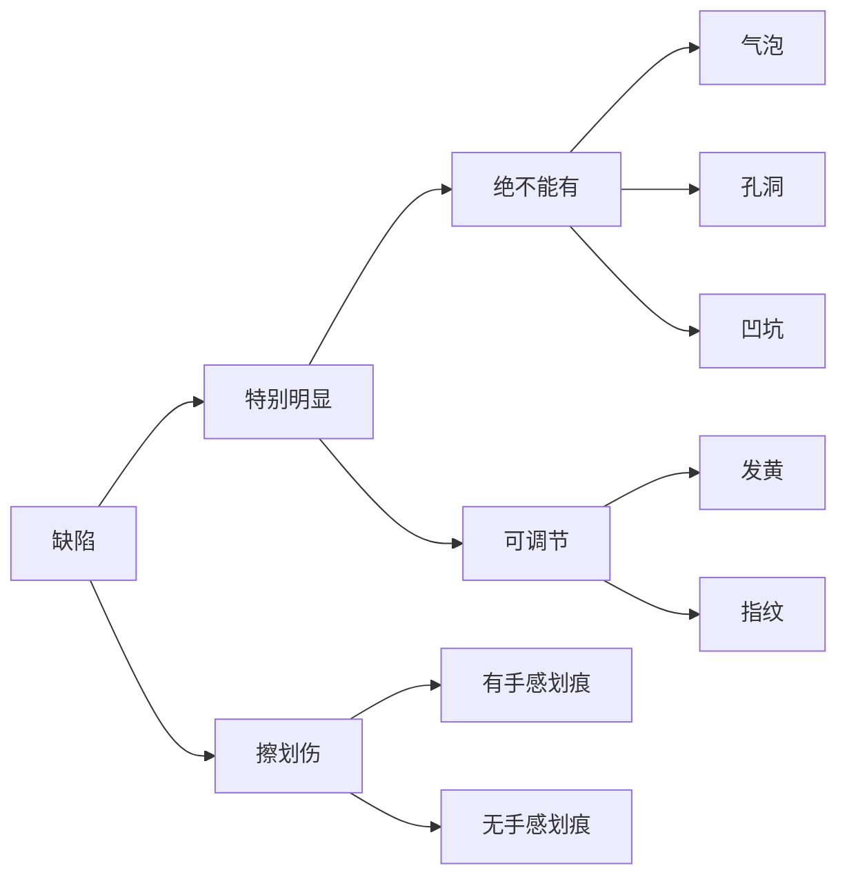

# Detection Requirements

## 产品检测分类

## 简单要求

### 硬件需求

1. 主机（可以是工控机或者普通电脑）
2. 相机 + 光源（可以购买现成的解决方案）
3. 取景范围（需要根据相机硬件进行部署）

### 检测算法要求

1. 日期
2. 样本数
3. 合格率
4. 不合格产品以及相应警报

### 用户操作软件要求

1. 可暂停视频流
2. 一帧一采（大致要求 0.5s 一张，这个可能会限制电脑性能）
3. 重新检测、主动检测按钮
4. 实体的脚踏开关、按钮等（可以购买现成的解决方案）

### 售后

1. 操作文档
2. 硬件部署
3. 程序部署
4. 新数据集的重训练（这个应当脱离现场，在服务器上进行）